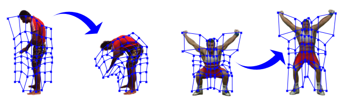
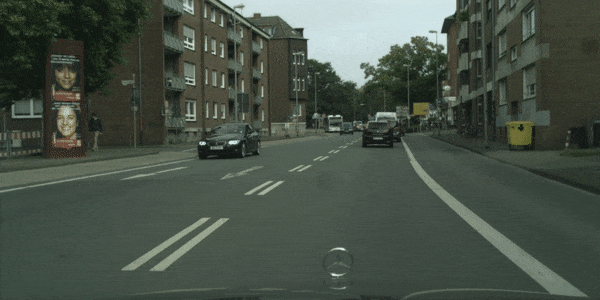

# WALDO - Official PyTorch Implementation

Code for ICCV'23 paper WALDO: Future Video Synthesis using Object Layer Decomposition and Parametric Flow Prediction.
<p align="center"></p>

> **WALDO: Future Video Synthesis using Object Layer Decomposition and Parametric Flow Prediction**<br>
> [Guillaume Le Moing](https://16lemoing.github.io/), [Jean Ponce](https://www.di.ens.fr/~ponce), [Cordelia Schmid](https://thoth.inrialpes.fr/~schmid) <br>

> Paper: https://arxiv.org/abs/2211.14308 <br>
> Project page: https://16lemoing.github.io/waldo <br>

> **Abstract:** *This paper presents WALDO (WArping Layer-Decomposed Objects), a novel approach to the prediction of future video frames from past ones. Individual images are decomposed into multiple layers combining object masks and a small set of control points. The layer structure is shared across all frames in each video to build dense inter-frame connections. Complex scene motions are modeled by combining parametric geometric transformations associated with individual layers, and video synthesis is broken down into discovering the layers associated with past frames, predicting the corresponding transformations for upcoming ones and warping the associated object regions accordingly, and filling in the remaining image parts. Extensive experiments on multiple benchmarks including urban videos (Cityscapes and KITTI) and videos featuring nonrigid motions (UCF-Sports and H3.6M), show that our method consistently outperforms the state of the art by a significant margin in every case.*


## Installation
The code was tested with pytorch 1.11.0 and python 3.9.7

To install dependencies with conda run:
```
conda env create -f env.yml
conda activate waldo
```

## Preprocessing

**1 - Cityscapes** - ([Website](https://www.cityscapes-dataset.com/)) - ([License](https://www.cityscapes-dataset.com/license/))

Create corresponding directory:
```
mkdir datasets/cityscapes
```

You first need to register and log in.
You can then download the video frames `leftImg8bit_sequence_trainvaltest.zip` and extract the data into `datasets/cityscapes/leftImg8bit_sequence`.

We detail preprocessing steps to generate semantic maps and flow maps in `data/preprocessing`.

**2 - KITTI** - ([Website](http://www.cvlibs.net/datasets/kitti/)) - ([License](http://creativecommons.org/licenses/by-nc-sa/3.0/))

Create corresponding directory:
```
mkdir datasets/kitti
```

You also need to register and log in.
You can then download the video frames by going to [this page](http://www.cvlibs.net/datasets/kitti/raw_data.php), and extract the data into `datasets/kitti/raw_data`.

Again, we detail preprocessing steps to generate semantic maps and flow maps in `data/preprocessing`.

## Training

We train separately each of the three modules of WALDO.

**1 - Layered video decomposition**

```
bash scripts/cityscapes/train_lvd.sh
bash scripts/kitti/train_lvd.sh
```

Checkpoints are saved in `checkpoints/` in a new folder whose name is a unique ID tag corresponding to the run, which we refer to as `LVD_TAG` in the following.

**2 - Future layer prediction**

```
bash scripts/cityscapes/train_flp.sh LVD_TAG
bash scripts/kitti/train_flp.sh LVD_TAG
```

Checkpoints are saved in `checkpoints/`, with corresponding tag `FLP_TAG`.

**3 - Warping, inpainting and fusion**

```
bash scripts/cityscapes/train_wif.sh LVD_TAG
bash scripts/kitti/train_wif.sh LVD_TAG
```

Checkpoints are saved in `checkpoints/`, with corresponding tag `WIF_TAG`.

## Demo

<p align="center"></p>

**1 - Download demo data**

Save [demo data](https://drive.google.com/file/d/1ApKhAwhGFHyAfKw2UG6F8UJfi-q6g-wK/view?usp=sharing) in the root folder and then extract:
```
unzip demo_datasets.zip
```

**2 - Download checkpoints**

Save [checkpoints weights](https://drive.google.com/file/d/1s2fa1rLqOI08fXlheMDNiW5-vdrHqr2C/view?usp=sharing) in the root folder and then extract:
```
unzip checkpoints.zip
```

**3 - Inference**

```
bash scripts/cityscapes/demo.sh
bash scripts/kitti/demo.sh
```
Videos are saved in `results/`.

## Evaluation

**1 - Inference**

```
bash scripts/cityscapes/test.sh LVD_TAG FLP_TAG WIF_TAG
bash scripts/kitti/test.sh LVD_TAG FLP_TAG WIF_TAG
```

Videos are saved in `results/`, with corresponding tag `VID_TAG`.

We provide [test data](https://drive.google.com/file/d/1y51OtU20OlYg7DwPGAEsZwkW8S7zPSQA/view?usp=sharing) for KITTI which can be used to reproduce the results from the paper using the pretrained checkpoints by running:
```
bash scripts/kitti/test.sh 2022-05-16-12:13:05-train_lvd_kitti 2022-05-18-07:57:54-train_flp_kitti 2022-05-18-08:07:27-train_wif_kitti
```

Please note that we disabled adversarial inpainting (using [MAT](https://github.com/fenglinglwb/MAT)) in `test.sh` since it has little to no impact to quantitative results. If you wish to use it, you can run `test_mat.sh`.

**2 - Metrics**

```
python tools/eval/metrics.py VID_TAG VID_LENGTH VID_CONTEXT
```

Set `VID_LENGTH` to the length of video sequences (typically, 14 for Cityscapes and 9 for KITTI) and `VID_CONTEXT` to the number of past context frames (typically, 4).


## Citation

If you find this code useful in your research, please consider citing:

    @inproceedings{lemoing2023waldo,
      title     = {{WALDO}: Future Video Synthesis using Object Layer Decomposition and Parametric Flow Prediction},
      author    = {Guillaume Le Moing and Jean Ponce and Cordelia Schmid},
      booktitle = {ICCV},
      year      = {2023}
    }

## License

WALDO is released under the [MIT license](LICENSE).